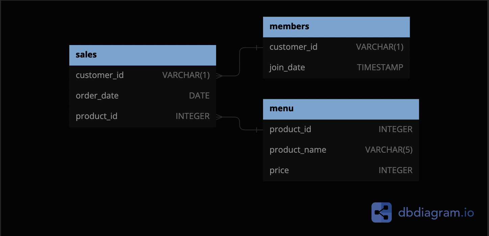

# Case Study #1: Danny's Diner

## Table of Contents
1. [Business Case](#business-case)
2. [Entity Relationship Diagram](#entity-relationship-diagram)
3. [Solutions](#solutions)

## Business Case
Danny's Diner is a small restaurant that serve three dishes -- sushi, curry, and ramen. They have collected several months of operational data that he wants to use to answer some key questions about his business. Namely, he wants to know how much money customers are spending, whether he should expand the customer loyalty program, what the main customer visiting patterns are, and what dishes are customers' favorites. He also wants to be able to create some data sets for his team so they do not need to use SQL. 

## Entity Relationship Diagram



## Solutions
**1. What is the total amount each customer spent at the restaurant?**

```sql
SELECT 
    sales.customer_id, 
    SUM(menu.price) AS sum_sales
FROM dannys_diner.sales
INNER JOIN dannys_diner.menu 
    ON sales.product_id = menu.product_id
GROUP BY sales.customer_id
ORDER BY sum_sales DESC;
```

| customer_id | sum_sales |
| ----------- | --------- |
| A           | 76        |
| B           | 74        |
| C           | 36        |

---
**2. How many days has each customer visited the restaurant?**

```sql
SELECT
    	sales.customer_id,
        COUNT(DISTINCT sales.order_date)
    FROM dannys_diner.sales
    GROUP BY customer_id;
```

| customer_id | count |
| ----------- | ----- |
| A           | 4     |
| B           | 6     |
| C           | 2     |

---
**3. What was the first item from the menu purchased by each customer?**

```sql
WITH RankedPurchases AS (
  SELECT 
    s.customer_id,
    s.order_date,
    m.product_name,
    ROW_NUMBER() OVER (PARTITION BY s.customer_id ORDER BY s.order_date) AS purchase_rank
  FROM 
    sales s
  JOIN 
    menu m ON s.product_id = m.product_id
)
SELECT 
  customer_id,
  order_date,
  product_name
FROM 
  RankedPurchases
WHERE 
  purchase_rank = 1;
```

| customer_id | order_date               | product_name |
| ----------- | ------------------------ | ------------ |
| A           | 2021-01-01T00:00:00.000Z | curry        |
| B           | 2021-01-01T00:00:00.000Z | curry        |
| C           | 2021-01-01T00:00:00.000Z | ramen        |

---
**4. What is the most purchased item on the menu and how many times was it purchased by all customers?**

```sql
SELECT 
  m.product_name,
  COUNT(s.product_id) AS purchase_count
FROM 
  sales s
JOIN 
  menu m ON s.product_id = m.product_id
GROUP BY 
  m.product_name
ORDER BY 
  purchase_count DESC
LIMIT 1;
```

| customer_id | order_date               | product_name |
| ----------- | ------------------------ | ------------ |
| A           | 2021-01-01T00:00:00.000Z | curry        |
| B           | 2021-01-01T00:00:00.000Z | curry        |
| C           | 2021-01-01T00:00:00.000Z | ramen        |

---

